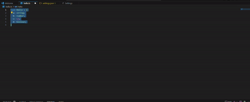
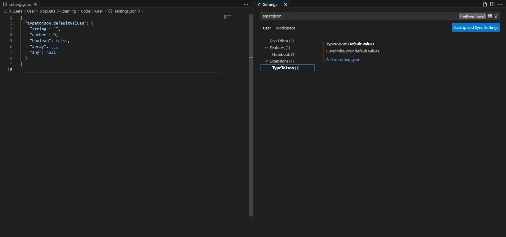

# typetojson README

This extension makes you get easier default values from your type or interface.

## Features

;

### How to use

1. Select your type or interface object.
2. Open Command palette by following command.

- Windows: `Ctrl+Shift+P`
- Mac: `Cmd+Shift+P`

3. Type `Type To Json`

## Extension Settings



### Properties

You could customize your default values.

```json
{
    {
        "typetojson.defaultValues": {
            "string": "hello",
            "number": 123,
            "boolean": false,
            "array": [],
            "any": null
        }
    }
}
```

Expected output with custom default values.

```json
{
  "a": "hello",
  "b": 123,
  "c": false,
  "d": [],
  "e": null
}
```

## Known Issues

This extension divide each type property with `;`. So you must divide each types with `;`.

I don't recommend change all types at once. Json will be broken.

## Release Notes

### 0.0.1

- Initial release

---
